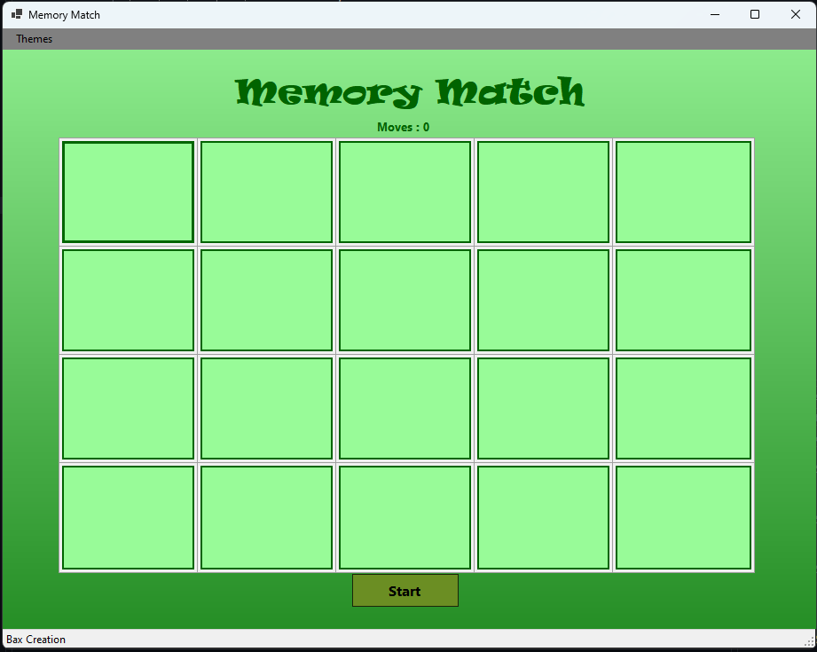
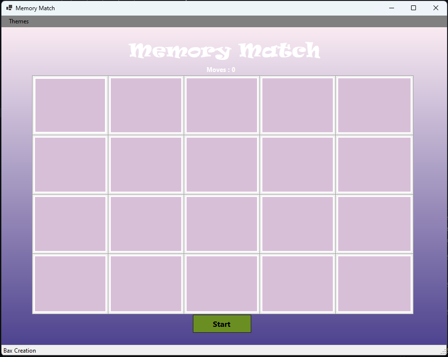
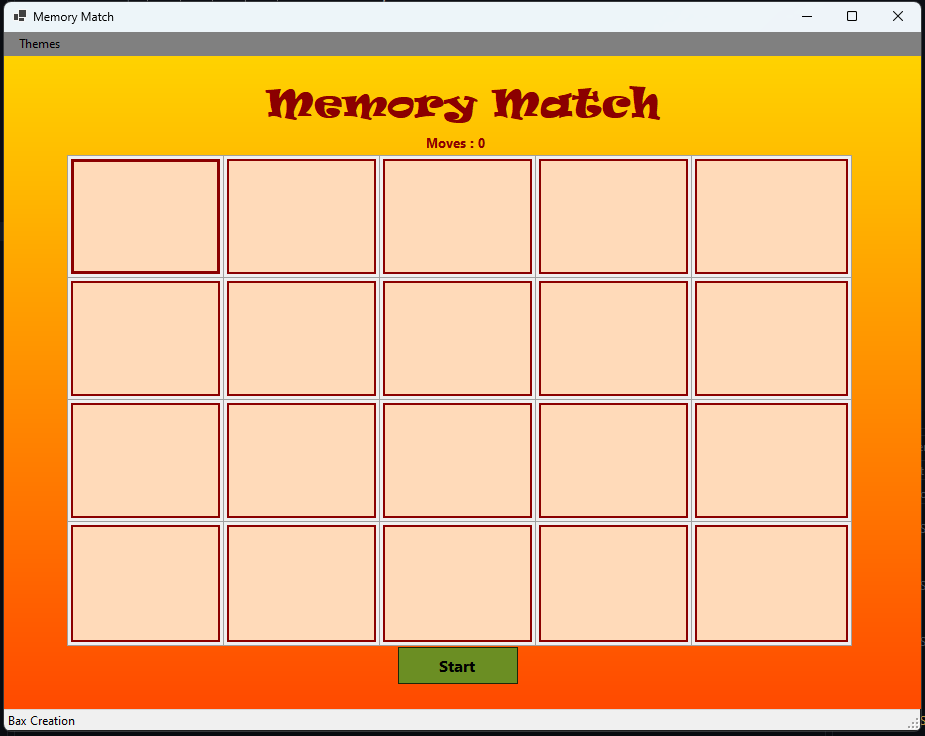
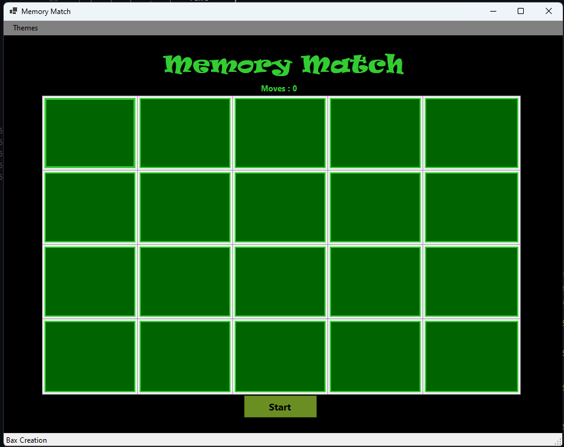

# Memory Match Game

Memory Match is a fun, customizable card-matching game built with Windows Forms in C#. 
Find all the matching pairs, and choose your favorite theme!

## How to Play

1. Click the **Start** button to shuffle and begin the game.
2. Flip two cards at a time by clicking on them.
3. If the two cards match, they stay revealed.
4. If they don’t match, they flip back after a short delay.
5. Find all matching pairs to win the game!

---

## Features

- **Card Matching Gameplay**: Flip and match pairs of cards with animations.
- **Dynamic Themes**: Customize the game with built-in themes, including:
  - Default
  - Cool Blues
  - Nature Greens
  - Elegant Purples
  - Bright Fun
  - Matrix
- **Sound Effects**: sounds for flips, matches, start of the game and ofcourse when win!
- **Animated Visuals**: Watch cards flip with smooth shrinking and growing animations.
- **Gradient Backgrounds**: Each theme offers a unique gradient background.
- **User-Friendly Menu**: Switch themes easily using the menu bar.

---

## Tech Used
- **C#**: Main programming language.
- **Windows Forms**: For the user interface.
- **.NET**: Version 8.0.

---

## How to Install

1. **Clone Repository:**
	- **https://github.com/bax082024/MemoryMatchV1.git**
2. Open project in **Visual Studio**.
3. Click **Rebuild Solution**

---

## How to Play

1. Start the game by clicking the **Start** button.
2. Flip two cards by clicking on them.
3. Match pairs of cards until all pairs are found.
4. Enjoy the sound effects and visuals as you play.

---

## Screenshot

---

## Contact 

- For questions or feedback, please contact:
- **bax082024@gmail.com**